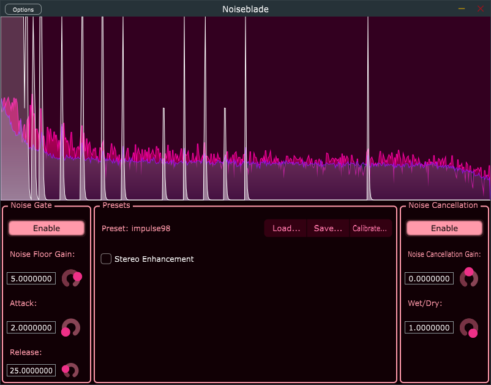

# What is this?
The purpose of the Noiseblade audio plugin is to remove unwanted noise from audio signal. It does that by combining two methods: (automatic) noise gate and noise cancellation. The noise gate is a classic method that simply mutes the audio if it is not above certain threshold. The noise cancellation is slightly more complicated; it calculates average signal FFT and then it removes signals that stick out from the noise signal.

# Limitations
* Handles only mono input.
* The program requires a noise removal profile, that the program automatically creates during startup. The profile can be saved and loaded as well. 
* The noise must have constant volume and frequency spikes, the program cannot remove background noise that is constantly changing (such as background tv), it is only meant to remove noise caused by electromagnetic interference or similar noise.

# How to build

Simply download [JUCE](https://github.com/juce-framework/JUCE) and open the Noiseblade.jucer with Projucer-program in the JUCE directory. Select your favorite IDE and platform and compile the plugin.

# License

GNU GPLv3 as that is also the license of JUCE framework.

[Read the full license](./LICENSE)
